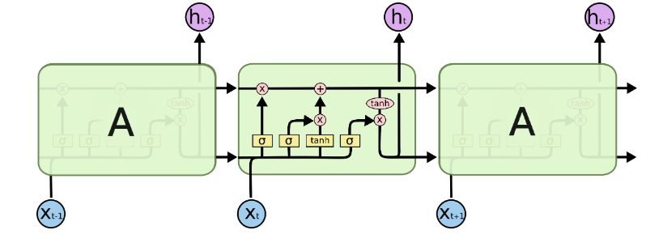

<!-- #region -->
# Forecasting with Ensembles and LSTM

Forecasting closing price using 


## Objective
<!-- #endregion -->

<!-- #region -->
Time series forecasting represents a challenging predictive task for researchers, since sequential dependencies shoud be addressed by the model, in other words, we aim to understand the past to be able to predict the future accurately.

Famous benchkmark models such as [ARIMA](https://en.wikipedia.org/wiki/Autoregressive_integrated_moving_average), [Exponential Smoothing](https://en.wikipedia.org/wiki/Exponential_smoothing) or baseline methods such as naive, average or drift, are popular among researchers because of their relatively accurate forecast and their ease of use and interpretation. These models usually require analysis of the series to find the correct number lags and autocorrelations, in some cases domain expertise it is also needed to have an accurate model. 

In the world famous Makridakis Competitions also known as [M-competitions](https://en.wikipedia.org/wiki/Makridakis_Competitions) where teams evaluate and compare the accuracy of different time series forecasting methods. During the first competitions, the statistically sophisticated methods did not provide significantly better forecasts than simpler ones.  Nevertheless, since the lasts M competitions, Machine Learning and Neural Network approaches proven to be effective and outperformed simple methods, one key advantage of these methods is that they require less domain expertise of the series and little configuration parameters.


This project aims to explore more complex algorithms for forecasting. In particular this repository explores Machine Learning ensemble (Random Forest) model, Deep Learning (LSTM-RNN) method and the [Facebook Prophet](https://facebook.github.io/prophet/) tool to forecast market data extracted from [Yahoo! Finance's API](https://www.yahoofinanceapi.com/)


### Models  Analyzed

### Random Forest Regression


It is an ensemble learning method that uses multiple decisions tree to obtain a better predictive performance than could be obtained of utilizing a single tree. Using this collection of trees, Random Forest averages the predictions of the decisions trees, improving the predictive accuracy while controlling over-fitting.


#### Random Forest Example


<div>

</div>
 
 
### Recurrent Neural Networks (RNNs)


Are a class of artificial neural networks that allow previous outputs to be used as inputs while having hidden states. These type of neural networks are useful for modeling sequential data and to give a notion of temporal dependece to the model. Recurrent Neural Networks's architechture contain loops that allow information to persist using the mentioned hidden state.

The main difference between non-recurrent architectures and recurrent architectures is the set of weights that connect the hidden layer from previous time steps to the current hidden layer.


#### Unrolled and recursive architecture of RNNs


 


Credits: [simplilearn](https://www.simplilearn.com/tutorials/deep-learning-tutorial/rnn)


The main short coming of this architecture is that it forgets the temporal dependencies really quickly. This issue is due to [vanishing gradient](https://en.wikipedia.org/wiki/Vanishing_gradient_problem). 

During the training phase of artificial neural networks with gradient-based methods and backpropagation, on each iteration weights (of NNs) update proportionally to the partial derivative of the error function with respect to the current weight. When training deep networks the derivates could get exponentially small. This problem is known as ***Vanishing Gradient***. This issue could prevet our model to capture long-term dependencies happening at the beginning of the sequence. 

To address this ***memory*** problem, more complex models had been designed ,one of the, is Long Short Term Memory (LSTM).


#### Long short-term memory  (LSTMs)


Are a special kind of RNNs, they are useful to capture long-term dependencies in a sequence. They were introduced by [Hochreiter & Schmidhuber](http://www.bioinf.jku.at/publications/older/2604.pdf) in their 1997 seminal paper.

LSTMs have a chain-like architecture, however, instead of having a single neural network layer, there have four interacting in with each other.

To carry information through the chain LSTMs feature a cell state.

The LSTM remove or add information to this cell state throug special structures called **gates**. The gates are composed by a feedforward layer and a sigmoid activation function. This sigmoid function determines how much information remove (*forget*) or add (*remember*) to the chain.

In LSTM architectures there are three main gates:

- Forget gate: Deletes information from the sequence that is not needed. 

- Input gate : Decides what new information is going to be stored in the cell state. First, it passes the input of the sequence through a sigmoid layer, then  passes the input through a tahn activation to create a vector of candidates of relevant information to remember.

The cell state is updated via a pointwise operation between the two outputs of these gates.

- Ouput gate: Decides which values should be sent to the network in the next time step.


In the final step, the cell state passes through a tahn activation and a pointwise operation is made with the ouput of the last gate.

#### Architecture of a LSTM

 
Credits: [Colah](https://colah.github.io/posts/2015-08-Understanding-LSTMs/)

#### Facebook Prophet

based on an additive model where non-linear trends are fit with yearly, weekly, and daily seasonality, plus holiday effects.
<!-- #endregion -->

<!-- #region -->
https://stanford.edu/~shervine/teaching/cs-230/cheatsheet-recurrent-neural-networks


https://colah.github.io/posts/2015-08-Understanding-LSTMs/

<!-- #endregion -->

```python

```
