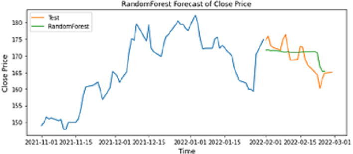
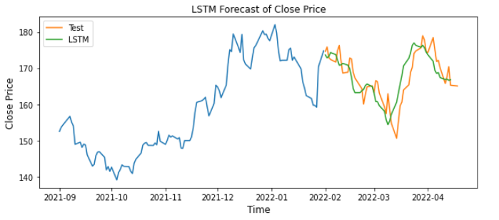

<!-- #region -->
# Forecasting with Ensembles and LSTM

Forecasting closing price using Apple (AAPL - NASDAQ) stock market data .

## Objective
<!-- #endregion -->

<!-- #region -->
Time series forecasting represents a challenging predictive task for researchers, since sequential dependencies on the data should be addressed by the model. Forecasting aims to understand the past to be able to predict the future accurately.

The benchkmark models such as [ARIMA](https://en.wikipedia.org/wiki/Autoregressive_integrated_moving_average), [Exponential Smoothing](https://en.wikipedia.org/wiki/Exponential_smoothing) or baseline methods such as naive, average or drift, are popular among researchers because of their ease of use and interpretation. These models usually require a deeper analysis of the time-series to find the correct number lags, trends and seasonality effects. In some cases, domain expertise it is needed to have accurate models. 

In the Makridakis Competitions also known as [M-competitions](https://en.wikipedia.org/wiki/Makridakis_Competitions) where teams evaluate and compare the accuracy of different time series forecasting methods. The statistcal sophisticated models did not provide significantly better forecasts than simpler ones, in particular during the first rounds of competitions.  Nevertheless, since the lasts M competitions, Machine Learning and Neural Network approaches proven to be effective and outperformed simple methods. One key advantage of these methods is that they require less domain expertise of the series and little configuration parameters.

This project aims to explore more complex algorithms for forecasting. In particular, this repository explores a Machine Learning ensemble (Random Forest) model, a Deep Learning (LSTM-RNN) method and the [Facebook Prophet](https://facebook.github.io/prophet/) tool to forecast time-series. The used in this project was extracted from [Yahoo! Finance's API](https://www.yahoofinanceapi.com/)

### Models  Analyzed

### Random Forest Regression

It is an ensemble learning method that uses multiple decision trees to obtain a better predictive performance. Using a collection of random decision trees, Random Forest averages their predictions, improving the predictive accuracy while controlling over-fitting.

#### Random Forest Example

 

 
### Recurrent Neural Networks (RNNs)

Are a class of artificial neural networks that allow previous outputs to be used as inputs while having hidden states. These types of neural networks are useful for modeling sequential data and to give a notion of temporal dependence to the model. Recurrent Neural Networks's architecture contains loops that allow information to persist using hidden states.

The main difference between non-recurrent architectures and recurrent architectures is the set of weights that connect the hidden layer through time steps.

#### Unrolled and recursive architecture of RNNs

 

Credits: [simplilearn](https://www.simplilearn.com/tutorials/deep-learning-tutorial/rnn)

The main short coming of this architecture is that it forgets the temporal dependencies really quickly. This issue is due to [vanishing gradient](https://en.wikipedia.org/wiki/Vanishing_gradient_problem). 

During the training phase of artificial neural networks with gradient-based methods and backpropagation, on each iteration weights (of NNs) update proportionally to the partial derivative of the error function with respect to the current weight. When training deep networks the derivates could get exponentially smaller. This problem is known as ***Vanishing Gradient***. This issue could prevent our model to capture long-term dependencies happening at the beginning of the sequence. 

To address this ***memory*** problem, more complex models had been designed one is Long Short Term Memory (LSTM).

#### Long short-term memory  (LSTMs)

Are a special kind of RNNs, they are useful to capture long-term dependencies in a sequence. They were introduced by [Hochreiter & Schmidhuber](http://www.bioinf.jku.at/publications/older/2604.pdf) in their 1997 seminal paper.

LSTMs have a chain-like architecture, however, instead of having a single neural network layer, there have four interacting in with each other.

To carry information through the chain LSTMs feature a cell state.

The LSTM remove or add information to this cell state through special structures called **gates**. The gates are composed by a feedforward layer and a sigmoid activation function. This sigmoid function determines how much information to remove (*forget*) or add (*remember*) to the chain.

In LSTM architectures, there are three main gates:

- Forget gate: Deletes information from the sequence that is not needed. 

- Input gate : Decides what new information is going to be stored in the cell state. First, it passes the input of the sequence through a sigmoid layer, then passes the input through a tahn activation to create a vector of candidates of relevant information to remember.

The cell state is updated via a pointwise operation between the two outputs of these gates.

- Ouput gate: Decides which values should be sent to the network in the next time step.

In the final step, the cell state passes through a tahn activation and a pointwise operation is made with the ouput of the last gate.

#### Architecture of a LSTM

 
Credits: [Colah](https://colah.github.io/posts/2015-08-Understanding-LSTMs/)

#### Facebook Prophet

It is a tool based on an additive model where non-linear trends are fitted with yearly, weekly, and daily seasonality. It can be used for modelling time series with complex seasonality effects, it is in particular useful for modeling daily data.

<!-- #endregion -->

## Results

<!-- #region -->
### Random Forest Regression

#### Prediction results forecasting 20 Business days

The ML approach shows a poor performance, the model was able to capture the downward trend of the series.

### Facebook Prophet

#### Prediction results 60 business days

Using Prophet, the prediction has a poor performance, using different values for `changepoint_prior_scale` did not improve results. Predictions are close to the average value of the series.

### LSTM model

#### Prediction results 53 business days

LSTM was close to capture the pattern, not perfect accuracy, but the model is close to predict the correct values.

# Dependencies

| Package      | Version |
|--------------|---------|
| matplotlib   | 3.5.1   |
| numpy        | 1.22.3  |
| pandas       | 1.4.2   |
| torch        | 1.11.0  |
| fbprophet    | 0.7.1   |
| scikit-learn | 1.0.2   |
| yfinance     | 0.1.70  |

# References

- [1] Christopher Olah - [article](https://colah.github.io/posts/2015-08-Understanding-LSTMs/)
- [2] Shervine Amidi CS 230 - Deep Learning - [notes](https://stanford.edu/~shervine/teaching/cs-230/cheatsheet-recurrent-neural-networks)
- [3] Sampling Generative Networks - [paper](https://arxiv.org/abs/1609.04468)
- [4] Jason Brownlee article about RNNs - [article](https://scholar.google.com/citationsview_op=view_citation&hl=en&user=hVaJhRYAAAAJ&citation_for_view=hVaJhRYAAAAJ:5ugPr518TE4C)
